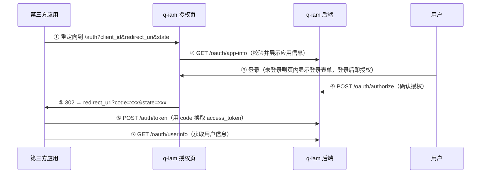

# q-iam OAuth2 对接指南

本文档面向**第三方应用/服务**接入 q-iam 的完整流程，包含两种授权模式、接口调用示例与安全要点。
所有接口路径均基于实测验证。

- 服务地址（默认）：`http://<q-iam-host>:8080`
- 管理接口前缀：`/api/v1`
- 认证方式：`Authorization: Bearer <access_token>`

---

## 1. 支持模式总览

| 模式 | 场景 | 令牌主体 |
| --- | --- | --- |
| `authorization_code` | 有用户参与、需获取**用户身份与授权**（Web 应用/SPA 授权登录） | 被授权的用户（`user`） |
| `client_credentials` | 纯服务间调用，无用户参与（后端服务/微服务） | 应用本身（`app`） |

---

## 2. 前置准备：创建应用

> 管理控制台为 q-iam 内置前端（本仓库 `ui/` 目录，构建产物经 Go embed 打进二进制）提供；下文同时给出直接调用 API 的方式。

在 q-iam 控制台「应用管理」中创建应用，或直接调用接口。

### 2.1 管理员登录获取令牌

```bash
curl -s -X POST http://127.0.0.1:8080/api/v1/auth/login \
  -H 'Content-Type: application/json' \
  -d '{"account_name":"admin","password":"admin123"}'
```

响应中的 `access_token` 作为后续管理操作的管理员令牌。

### 2.2 创建应用（授权码模式）

```bash
curl -s -X POST http://127.0.0.1:8080/api/v1/apps \
  -H "Authorization: Bearer <ADMIN_TOKEN>" \
  -H 'Content-Type: application/json' \
  -d '{
    "name": "我的应用",
    "grant_type": "authorization_code",
    "callback_url": "https://app.example.com/callback",
    "description": "接入 q-iam 的第三方应用",
    "status": true
  }'
```

**响应**（`app_secret` 仅此一次返回，务必保存）：

```json
{
  "code": 0,
  "msg": "ok",
  "data": {
    "id": 1,
    "name": "我的应用",
    "app_id": "app-b9686e73f842e12b",
    "app_secret": "c99ef3c8e9e2472bba02a876789a8559",
    "grant_type": "authorization_code",
    "callback_url": "https://app.example.com/callback",
    "status": true
  }
}
```

| 字段 | 说明 |
| --- | --- |
| `app_id` | 客户端 ID（client_id），对外公开 |
| `app_secret` | 客户端密钥（client_secret），仅创建/重置时返回一次 |

> **注意**：授权码模式**必须配置 `callback_url`**（防开放重定向），且授权时 `redirect_uri` 需与之**精确匹配**（不区分大小写）。

### 2.3 创建应用（客户端凭证模式）

只需把 `grant_type` 改为 `client_credentials`，`callback_url` 可省略：

```bash
curl -s -X POST http://127.0.0.1:8080/api/v1/apps \
  -H "Authorization: Bearer <ADMIN_TOKEN>" \
  -H 'Content-Type: application/json' \
  -d '{
    "name": "后端服务",
    "grant_type": "client_credentials",
    "status": true
  }'
```

---

## 3. 授权码模式（authorization_code）对接流程

适用于 Web 应用/SPA 的**第三方授权登录**。完整时序：



### 3.1 第一步：构造授权链接

将用户引导至 q-iam 授权页（由 q-iam 内置前端提供，SPA 页面走前端路由）：

```text
http://127.0.0.1:8080/auth?client_id=<app_id>&redirect_uri=<回调地址>&scope=<范围>&state=<随机串>
```

| 参数 | 必填 | 说明 |
| --- | --- | --- |
| `client_id` | ✅ | 应用的 `app_id` |
| `redirect_uri` | ✅ | 回调地址，须与应用配置的 `callback_url` **精确匹配** |
| `scope` | 可选 | 申请的范围（空格分隔），如 `profile email` |
| `state` | 建议 | 防 CSRF 的随机串，回调时原样带回 |

> **scope 展示**：授权页会把空格分隔的 scope 解析为**逐条权限列表**展示（`openid/profile/email/phone/iam:read/iam:write` 等有中文说明），未传 scope 时展示基础信息。未知 scope 会原样显示并注明「应用自定义」。

### 3.2 第二步：用户登录并授权（两步式授权确认）

授权页为 OAuth2 consent 风格的两步式流程：

1. **步骤 ① 登录**：未登录时页内直接显示登录表单（授权确认本质上也是登录）；登录成功后**同页就地进入授权确认，不跳转**
2. **步骤 ② 授权确认**：展示「以 @账号 身份」+ 应用申请的权限列表，操作按钮为「取消 / 允许 {应用名}」

其他说明：

- 注册账号（`allow_console=false`）也可用于授权登录
- 授权页展示应用信息（名称、描述）、授权后跳转域名提示、申请权限列表
- 已登录时可直接「切换账号」后重新授权

### 3.3 第三步：接收回调（拿到授权码 code）

授权成功后浏览器跳回 `redirect_uri`：

```text
https://app.example.com/callback?code=<authorization_code>&state=<原样带回>
```

**必须校验 `state` 与发起时一致**，防止 CSRF。

### 3.4 第四步：用 code 换取 access_token

```bash
curl -s -X POST http://127.0.0.1:8080/api/v1/auth/token \
  -H 'Content-Type: application/json' \
  -d '{
    "grant_type": "authorization_code",
    "app_id": "<app_id>",
    "app_secret": "<app_secret>",
    "code": "<authorization_code>"
  }'
```

**响应**：

```json
{
  "code": 0,
  "msg": "ok",
  "data": {
    "access_token": "eyJhbGciOiJIUzI1NiIs...",
    "token_type": "Bearer",
    "expires_in": 7200,
    "scope": "profile email"
  }
}
```

| 字段 | 说明 |
| --- | --- |
| `access_token` | 访问令牌（JWT），`expires_in` 秒后过期 |
| `expires_in` | 有效秒数（OAuth 标准语义，7200 = 2 小时） |

> **授权码一次性**：每个 code 只能用一次，重放会返回 `授权码无效或已使用`。

**错误响应（RFC 6749 §5.2 标准格式）**：

`/auth/token` 失败时返回**标准 OAuth 状态码** + `{error, error_description}`（而非统一 200 + `{code,msg}`）：

| 场景 | HTTP 状态码 | `error` |
| --- | --- | --- |
| 凭证无效 / 应用禁用 | 401 | `invalid_client` |
| 授权码无效、已使用或与应用不匹配 | 400 | `invalid_grant` |
| 缺少 `code` | 400 | `invalid_request` |
| 应用不支持请求的授权类型 | 400 | `unauthorized_client` |
| 全局限流 | 503 | `temporarily_unavailable` |

```json
{
  "error": "invalid_grant",
  "error_description": "授权码无效或已使用"
}
```

### 3.5 第五步：调用 UserInfo 获取用户信息

```bash
curl -s http://127.0.0.1:8080/api/v1/oauth/userinfo \
  -H "Authorization: Bearer <access_token>"
```

**响应**：

```json
{
  "code": 0,
  "msg": "ok",
  "data": {
    "sub": "user:alice",
    "client_id": "app-b9686e73f842e12b",
    "app_name": "我的应用",
    "scope": "profile email",
    "aud": "app-b9686e73f842e12b",
    "user": {
      "account_id": 2,
      "account_name": "alice",
      "display_name": "Alice",
      "email": "",
      "mobile": ""
    },
    "permissions": [
      {
        "effect": "Allow",
        "action": "iam:account:read",
        "source": "ReadOnly",
        "data_scopes": []
      }
    ]
  }
}
```

| 字段 | 说明 |
| --- | --- |
| `sub` | 主体标识（`user:<account_name>` 或 `app:<app_id>`） |
| `user` | 用户信息（仅授权码模式令牌有） |
| `permissions` | 用户生效的权限规则（含来源策略名与数据范围） |
| `scope` / `aud` | 已授权范围 / 受众（应用 ID） |

> **错误响应**：令牌无效 / 过期 / 应用被删时返回 `401` + `{"error": "invalid_token", "error_description": "..."}`（RFC 6750），而非统一 200。

---

## 4. 客户端凭证模式（client_credentials）对接流程

适用于**服务间调用**（后端服务 → q-iam 资源），无用户参与。

### 4.1 直接换取令牌

```bash
curl -s -X POST http://127.0.0.1:8080/api/v1/auth/token \
  -H 'Content-Type: application/json' \
  -d '{
    "grant_type": "client_credentials",
    "app_id": "<app_id>",
    "app_secret": "<app_secret>",
    "scope": "<可选范围>"
  }'
```

**响应**：

```json
{
  "code": 0,
  "msg": "ok",
  "data": {
    "access_token": "eyJhbGciOiJIUzI1NiIs...",
    "token_type": "Bearer",
    "expires_in": 7200,
    "scope": ""
  }
}
```

### 4.2 用应用令牌获取权限

应用令牌无 `user` 信息，返回的是**应用绑定的策略权限**（供资源服务器做授权判定）：

```bash
curl -s http://127.0.0.1:8080/api/v1/oauth/userinfo \
  -H "Authorization: Bearer <access_token>"
```

**响应**：

```json
{
  "code": 0,
  "data": {
    "sub": "app:app-694a2e4691bcf9da",
    "client_id": "app-694a2e4691bcf9da",
    "app_name": "后端服务",
    "permissions": []
  }
}
```

---

## 5. 数据权限接口（按需拉取）

资源服务器可调用该接口获取当前主体的**权限规则 + 数据范围（data_scopes）**，适合做行级数据过滤：

```bash
curl -s http://127.0.0.1:8080/api/v1/auth/data-permissions \
  -H "Authorization: Bearer <access_token>"
```

**响应**（用户令牌示例）：

```json
{
  "code": 0,
  "data": {
    "subject_type": "user",
    "user": {
      "account_id": 2,
      "account_name": "alice",
      "display_name": "Alice",
      "group_ids": [1, 3]
    },
    "permissions": [
      {
        "effect": "Allow",
        "action": "iam:order:read",
        "source": "OrderPolicy",
        "data_scopes": [
          { "scope_type": "group", "group_id": 3 },
          { "scope_type": "self", "owner_field": "owner_id" }
        ]
      }
    ]
  }
}
```

数据范围类型（`scope_type`）：

| 类型 | 含义 |
| --- | --- |
| `all` | 全部数据 |
| `group` | 本用户分组的数据（按 `group_ids` 并集） |
| `self` | 仅本人数据（按 `owner_field`，值为当前账号 ID） |
| `attribute` | 按数据属性/标签过滤（`attr_key` + `attr_value`） |

---

## 6. 接口速查表

| 方法 | 路径 | 认证 | 说明 |
| --- | --- | --- | --- |
| GET | `/auth?client_id=&redirect_uri=` | 浏览器（SPA 页面） | 统一认证页 · 授权确认模式（前端路由，未登录页内登录） |
| GET | `/api/v1/oauth/app-info?client_id=` | 无 | 查询应用信息（授权页展示用） |
| POST | `/api/v1/oauth/authorize` | Bearer（用户） | 签发一次性授权码 |
| POST | `/api/v1/auth/token` | 无（凭证换令牌） | 换 access_token（两种模式） |
| GET | `/api/v1/oauth/userinfo` | Bearer（应用令牌） | 用户/应用信息 + 权限 |
| GET | `/api/v1/auth/data-permissions` | Bearer | 权限规则 + 数据范围 |
| POST | `/api/v1/apps` | Bearer（`iam:app:write`） | 创建应用 |
| POST | `/api/v1/apps/{id}/reset-secret` | Bearer（`iam:app:write`） | 重置密钥 |

---

## 7. 安全要点

1. **回调地址**：授权码模式必须配置 `callback_url`，`redirect_uri` 精确匹配，防开放重定向/钓鱼。
2. **`state` 参数**：授权请求携带随机 `state`，回调时校验，防 CSRF。
3. **授权码一次性**：唯一 jti 消费校验，防重放。
4. **跨应用隔离**：code 只能被签发给它的应用换取（`授权码与应用不匹配`）。
5. **`app_secret` 保密**：仅创建/重置时返回明文，服务端加密存储；泄露后立即在控制台重置。
6. **令牌过期**：`expires_in` 为有效秒数，过期后需重新走授权流程（或由 q-iam 登录态通过 `/auth/refresh` 续期）。
7. **密钥不落日志**：审计与日志均不记录 `app_secret`/密码明文。

---

## 8. 常见问题（FAQ）

**Q1：授权返回"应用未配置回调地址"？**
授权码模式必须先在应用管理中配置 `callback_url`。

**Q2：换 token 报"授权码与应用不匹配"？**
code 是绑定应用的，需用签发该 code 的 `app_id`+`app_secret` 换取。

**Q3：换 token 报"授权码无效或已使用"？**
授权码 5 分钟有效且一次性；超时或已消费都会报此错，需重新发起授权。

**Q4：userinfo 返回没有 `user` 字段？**
说明令牌是 client_credentials 应用令牌（主体为应用）；用户令牌（授权码模式）才有 `user`。

**Q5：多节点部署下授权码防重放？**
当前授权码一次性校验为**进程内内存实现**，多节点水平扩展需将防重放存储切换为 Redis 共享存储。

---

## 9. 登录态共享（同域/子域系统）

q-iam 管理控制台登录成功后，前端会把令牌写入 **JS 可读的 cookie**，供**同域/子域的其它系统**直接读取并解析 JWT（无需后端介入）：

| Cookie 名称 | 内容 |
| --- | --- |
| `qiam.access_token` | 访问令牌（JWT，含 `user_id`/`username`/`exp`，可解码获取用户与权限） |
| `qiam.refresh_token` | 刷新令牌（7 天） |
| `qiam.expires_at` | 访问令牌过期时间戳（Unix 秒） |

**其它系统读取示例**（同域/子域前端）：

```js
const token = document.cookie.match(/qiam\.access_token=([^;]+)/)?.[1]
// 解码 JWT payload
const payload = JSON.parse(atob(token.split('.')[1]))
// { user_id: 1, username: "admin", token_type: "access", exp: ... }
```

**子域共享**：部署时通过环境变量 `VITE_COOKIE_DOMAIN` 指定父域（如 `VITE_COOKIE_DOMAIN=.example.com`），`example.com` 下所有子域即可共享登录态。

> ⚠️ **安全注意**：该 cookie 为**非 httpOnly**，同域/子域所有脚本均可读取，存在 XSS 窃取风险。仅应在**同一信任域**内共享；若需更严格的隔离，应由各系统后端校验令牌签名后使用，而非前端直接读取。前端退出登录会自动清除上述 cookie。

---

## 10. 附录：基于 `golang.org/x/oauth2` 的 Go 客户端接入示例

> **说明**：`golang.org/x/oauth2` 是 **OAuth2 客户端库**（不是授权服务器库），适用于第三方系统**接入 q-iam**。下面的示例演示一个标准 Web 应用如何用该库走 `authorization_code` 流程完成授权登录并拉取用户信息。

### 10.1 与标准 OAuth2 的差异说明

`golang.org/x/oauth2` 的 `Config.Exchange` 默认以 `application/x-www-form-urlencoded` 表单 + `client_id`/`client_secret` 字段调用 token 端点；而 q-iam 的 `/auth/token` 接受 **JSON body** 且字段名为 `app_id`/`app_secret`（见 §3.4）。因此示例中：

- 用 `oauth2.Config.AuthCodeURL` 生成授权链接（q-iam 授权页只认 `client_id`/`redirect_uri`/`scope`/`state`，多余的 `response_type=code` 会被忽略，可安全使用）；
- 回调中**自定义 POST** 到 `/auth/token` 换取令牌（与 q-iam 实际端点对接）；
- 用 `oauth2.StaticTokenSource` + `oauth2.NewClient` 自动为 UserInfo 请求附加 `Authorization: Bearer`。

### 10.2 完整示例（Web 应用）

```go
package main

import (
	"context"
	"encoding/json"
	"fmt"
	"io"
	"log"
	"net/http"
	"os"
	"strings"
	"time"

	"golang.org/x/oauth2"
)

// q-iam 授权服务器配置
var (
	qiamBase = "http://127.0.0.1:8080" // q-iam 服务地址
	myAddr   = "127.0.0.1:8081"         // 本示例服务监听地址

	// 在 q-iam 控制台「应用管理」创建应用后填入（authorization_code 模式）
	appID     = os.Getenv("APP_ID")     // 应用 app_id
	appSecret = os.Getenv("APP_SECRET") // 应用 app_secret

	cfg = &oauth2.Config{
		ClientID:     appID,
		ClientSecret: appSecret,
		Endpoint: oauth2.Endpoint{
			AuthURL:  qiamBase + "/auth",                // q-iam 统一授权页（SPA）
			TokenURL: qiamBase + "/api/v1/auth/token",   // q-iam token 端点
		},
		RedirectURL: "http://" + myAddr + "/callback",
		Scopes:      []string{"profile", "email"},
	}
)

// tokenResp 对齐 q-iam /auth/token 的 JSON 响应
// （x/oauth2 的 Token 结构与之字段名不一致，这里自定义反序列化）
type tokenResp struct {
	AccessToken string `json:"access_token"`
	TokenType   string `json:"token_type"`
	ExpiresIn   int64  `json:"expires_in"`
	Scope       string `json:"scope"`
}

// exchangeCode 用授权码换令牌（对齐 q-iam JSON 端点，替代 oauth2.Config.Exchange）
func exchangeCode(code string) (*oauth2.Token, error) {
	body := fmt.Sprintf(
		`{"grant_type":"authorization_code","app_id":%q,"app_secret":%q,"code":%q}`,
		appID, appSecret, code,
	)
	resp, err := http.Post(cfg.Endpoint.TokenURL, "application/json", strings.NewReader(body))
	if err != nil {
		return nil, err
	}
	defer resp.Body.Close()

	data, err := io.ReadAll(resp.Body)
	if err != nil {
		return nil, err
	}

	// q-iam 成功返回统一包装 {code, msg, data}；失败返回标准 OAuth 错误 {error, error_description}
	var wrapped struct {
		Code int      `json:"code"`
		Data tokenResp `json:"data"`
	}
	if err := json.Unmarshal(data, &wrapped); err != nil || wrapped.Code != 0 {
		return nil, fmt.Errorf("换取令牌失败: %s", string(data))
	}

	return &oauth2.Token{
		AccessToken: wrapped.Data.AccessToken,
		TokenType:   wrapped.Data.TokenType,
		Expiry:      oauth2TokenExpiry(wrapped.Data.ExpiresIn),
	}, nil
}

// oauth2TokenExpiry 由秒数换算过期时间（不引入额外依赖的极简实现）
func oauth2TokenExpiry(expiresIn int64) time.Time {
	return time.Now().Add(time.Duration(expiresIn) * time.Second)
}

func main() {
	// ① 发起授权：跳转到 q-iam 授权页
	http.HandleFunc("/login", func(w http.ResponseWriter, r *http.Request) {
		state := "random-csrf-token" // 建议 crypto/rand 生成，回调时校验
		// 生成授权链接（response_type 参数由库自动添加，q-iam 忽略）
		http.Redirect(w, r, cfg.AuthCodeURL(state), http.StatusFound)
	})

	// ② 回调：校验 state → 换令牌 → 拉取用户信息
	http.HandleFunc("/callback", func(w http.ResponseWriter, r *http.Request) {
		code := r.URL.Query().Get("code")
		state := r.URL.Query().Get("state")
		if state != "random-csrf-token" { // 实际应用中应比对会话中保存的 state
			http.Error(w, "state 不匹配", http.StatusBadRequest)
			return
		}

		tok, err := exchangeCode(code)
		if err != nil {
			http.Error(w, err.Error(), http.StatusBadRequest)
			return
		}

		// 用 StaticTokenSource + NewClient 自动附加 Bearer，调用 UserInfo
		src := oauth2.StaticTokenSource(tok)
		client := oauth2.NewClient(context.Background(), src)
		userinfo, err := client.Get(qiamBase + "/api/v1/oauth/userinfo")
		if err != nil {
			http.Error(w, err.Error(), http.StatusInternalServerError)
			return
		}
		defer userinfo.Body.Close()

		data, _ := io.ReadAll(userinfo.Body)
		fmt.Fprintf(w, "用户信息: %s", data)
	})

	log.Printf("示例客户端已启动: http://%s/login", myAddr)
	log.Fatal(http.ListenAndServe(myAddr, nil))
}
```

### 10.3 运行步骤

```bash
# ① 引入依赖
cd /path/to/your-app && go get golang.org/x/oauth2

# ② 在 q-iam 控制台创建 authorization_code 应用，配置回调地址 http://127.0.0.1:8081/callback
# ③ 导出应用凭证并启动
APP_ID=app-xxxx APP_SECRET=xxxx go run .

# ④ 浏览器访问 http://127.0.0.1:8081/login → 跳转 q-iam 授权页 → 登录/授权 → 回跳展示用户信息
```

### 10.4 客户端凭证模式（服务间调用）

`client_credentials` 无用户参与，直接用 `http.Post` 换取令牌即可（无需 `x/oauth2` 授权链接）：

```go
func fetchAppToken() (*oauth2.Token, error) {
	body := fmt.Sprintf(
		`{"grant_type":"client_credentials","app_id":%q,"app_secret":%q}`,
		appID, appSecret,
	)
	resp, err := http.Post(cfg.Endpoint.TokenURL, "application/json", strings.NewReader(body))
	if err != nil {
		return nil, err
	}
	defer resp.Body.Close()
	// ... 解析与上面 exchangeCode 相同，略
}
```

> 💡 **更贴近 x/oauth2 标准流程**：若希望直接使用 `cfg.Exchange(code)`（库内部以表单 + `client_id`/`client_secret` 调用 token 端点），需让 q-iam `/auth/token` 兼容 `application/x-www-form-urlencoded` 请求并识别 `client_id`/`client_secret` 字段。当前版本使用 JSON + `app_id`/`app_secret`，故示例采用自定义换取。若需此项适配，可在 q-iam 侧扩展 Token 解析逻辑。
